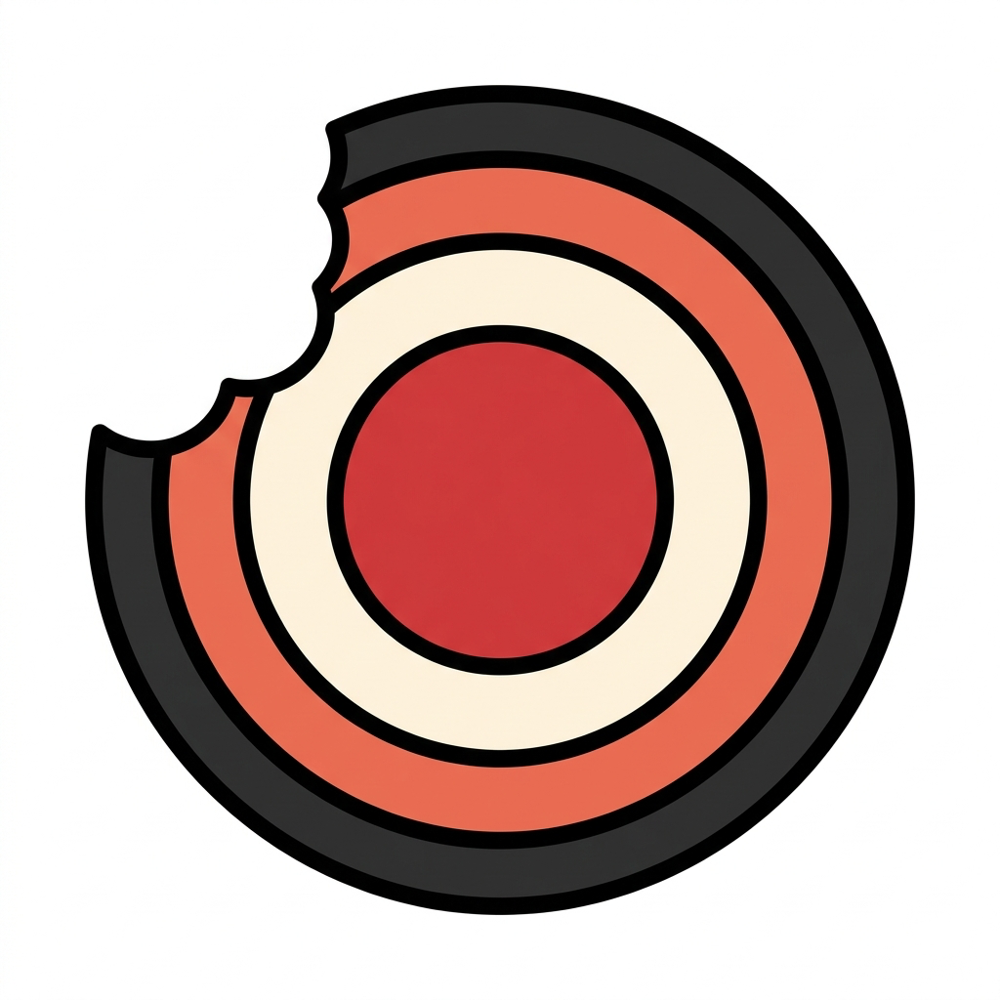

  

# Jawbreaker

Scam defense for someone you love.

## TL;DR for Judges

- **Backyard AI:** a practical scam-defense safety card for non-technical people and their families.
- **Best MiniCPM Build / Tiny Titan / Well-Tuned:** `openbmb/MiniCPM5-1B` + [Jawbreaker LoRA v8](https://huggingface.co/build-small-hackathon/jawbreaker-minicpm5-1b-lora-v8), evaluated on a 632-case hard suite with **0 dangerous undercalls** and **0 safe overcalls**.
- **Best Use of Modal:** Modal A100 was used for LoRA training and guarded eval runs; see [`training/modal_train.py`](training/modal_train.py), [`training/modal_eval.py`](training/modal_eval.py), the [`632-case v8 report`](eval/reports/jawbreaker-minicpm5-1b-lora-v8-hard632-safetyguard-v4.json), plus the earlier [`394-case v4 report`](eval/reports/jawbreaker-minicpm5-1b-lora-v4-hard394-guarded.json).
- **OpenAI / Best Use of Codex:** Codex-attributed commits plus [`CODEX_JUDGE_EVIDENCE.md`](CODEX_JUDGE_EVIDENCE.md), [`AGENT_TRACE.md`](AGENT_TRACE.md), and [`CODEX_BUILD_LOG.md`](CODEX_BUILD_LOG.md), with file-level contribution notes below.
- **Off Brand / Off the Grid / Sharing is Caring / Field Notes:** custom candy-brutalist Gradio UI, no external LLM API, public [dataset/eval bundle](https://huggingface.co/datasets/build-small-hackathon/jawbreaker-scam-defense-data), and [`FIELD_NOTES.md`](FIELD_NOTES.md).
- **Submission package:** [Live Space](https://huggingface.co/spaces/build-small-hackathon/jawbreaker), [model](https://huggingface.co/build-small-hackathon/jawbreaker-minicpm5-1b-lora-v8), [dataset](https://huggingface.co/datasets/build-small-hackathon/jawbreaker-scam-defense-data), and [collection](https://huggingface.co/collections/build-small-hackathon/jawbreaker-6a263632dcd0b6d41ca914ff).

Jawbreaker is built around direct small-model inference to protect user privacy. The public hackathon Space runs MiniCPM5-1B + Jawbreaker LoRA on Hugging Face ZeroGPU for judge access, and the repo keeps local Transformers/GGUF tooling for running without hosted LLM APIs.

Jawbreaker helps a real person pause before clicking, replying, or sending money. Paste a suspicious text, email, or DM and Jawbreaker breaks it into plain-English warning signs: what the sender is pretending to be, what pressure tactic is being used, what they want, and the safest next step.

The problem is specific: scam messages now arrive as urgent, personal, plausible requests. A package fee, a bank callback, a fake recruiter, or a "new phone number" from a family member can pressure someone into clicking or paying before they ask for help. Jawbreaker turns that moment into a small safety workflow: paste the message, get a clear verdict, see the warning signs, and copy a short plan to someone you trust.

## Hackathon

- Event: Hugging Face Build Small Hackathon
- Track: Backyard AI
- App: Gradio Space under `build-small-hackathon`
- Status: Public Space deployed; demo/story polish in progress
- Demo video: To be added before submission
- Social post: To be added before submission
- Public GitHub repo: https://github.com/gowtham0992/jawbreaker
- Live Space: https://huggingface.co/spaces/build-small-hackathon/jawbreaker
- Final model adapter: https://huggingface.co/build-small-hackathon/jawbreaker-minicpm5-1b-lora-v8
- Public dataset/eval bundle: https://huggingface.co/datasets/build-small-hackathon/jawbreaker-scam-defense-data
- Hugging Face collection: https://huggingface.co/collections/build-small-hackathon/jawbreaker-6a263632dcd0b6d41ca914ff

Submission checklist:

- **REQ-01 / Stay under 32B:** complete. The live model is `openbmb/MiniCPM5-1B`.
- **REQ-02 / Ship a Gradio app:** complete. Jawbreaker is a public Gradio Space in `build-small-hackathon`.
- **REQ-03 / Record a demo:** pending. Demo video link will be added before final submission.
- **REQ-04 / Post it:** pending. Social post link will be added before final submission.
- **REQ-05 / Mind the GPU limit:** complete. This is one ZeroGPU Space, below the limit.
- **REQ-06 / Tag your README:** complete. Frontmatter includes the main track, sponsor tracks, and claimed bonus badges.

## Built With OpenAI Codex

This project is being built with OpenAI Codex in the Codex desktop app. Codex is being used for planning, implementation, eval design, Gradio UI iteration, testing, deployment, and submission documentation.

Codex evidence:

- Public GitHub repo linked from this Space README.
- Codex-attributed commits are included for build work.
- `CODEX_JUDGE_EVIDENCE.md` maps Codex-attributed commits to concrete files, model/eval decisions, and final public artifacts.
- Codex scaffolded and iterated on `app.py`, the custom Gradio Server UI, `jawbreaker/` analyzer/schema/render modules, `eval/run_eval.py`, `training/train_lora.py`, `training/modal_train.py`, `training/modal_eval.py`, and the public submission docs.
- `AGENT_TRACE.md` records the development process.
- `FIELD_NOTES.md` records product and technical decisions.
- `HONEST_SUBMISSION.md` records what the project can and cannot honestly claim.

## Why This Is Small

Jawbreaker is deliberately narrow. It does not try to be a general assistant or chatbot. It performs one safety task:

1. Read one suspicious message.
2. Identify scam risk and manipulation tactics.
3. Give one clear safe action.
4. Help the user ask someone they trust.

## Model Runtime

The deployed Space uses `openbmb/MiniCPM5-1B` through Hugging Face Transformers on ZeroGPU with the published Jawbreaker LoRA adapter:

- Adapter: `build-small-hackathon/jawbreaker-minicpm5-1b-lora-v8`
- Training: PEFT/LoRA on Modal A100
- Eval: guarded Modal A100 run across the 632-case hard v8 suite, with earlier 320/394-case v4 comparison runs
- Runtime: ZeroGPU in the Hugging Face Space
- Off the Grid: the app loads and runs the small open model directly through Transformers in the Space runtime; it does not call OpenAI, Anthropic, hosted MiniCPM, or other external LLM APIs for inference

Why this model:

- It makes OpenBMB MiniCPM central to the app, matching the hackathon sponsor track.
- It is a 1B model, which fits the Tiny Titan spirit while staying useful on a narrow task.
- The 1B v8 adapter keeps the Tiny Titan/OpenBMB path while clearing the broader 632-case safety gate.
- It avoids external commercial model APIs.
- It can produce the structured JSON that Jawbreaker validates before rendering.

The local/eval path still supports GGUF models through `llama-cpp-python`, including Qwen and MiniCPM GGUF candidates. The CPU GGUF path is kept as evidence and tooling, while the judge-facing Space uses ZeroGPU because first-click cold-start latency matters for the product experience.

Safety architecture:

- Model output must parse as JSON and match the required schema.
- A deterministic heuristic guard catches weak model outputs that under-call obvious danger.
- If MiniCPM generation fails or returns malformed JSON, Jawbreaker falls back to deterministic safety analysis instead of showing an unusable error state.
- The UI always recommends verification through official channels or a known phone number, never the suspicious link or number.
- Session memory is local to the current Gradio session and helps show repeated scam patterns.

Current eval results:

- 632-case hard guarded eval, 1B v8: `579/632` risk accuracy (`91.61%`), **`0` dangerous-as-safe**, `0` dangerous-as-needs-check, `0` safe-as-dangerous-or-suspicious, `0` unsafe action violations, `0` invalid predictions, `0` model errors.
- Earlier comparison evidence, 1B v4: 394-case hard guarded eval at `379/394` risk accuracy (`96.19%`) and 320-case hard guarded eval at `310/320` risk accuracy (`96.88%`), both with no dangerous undercalls.

Training/eval artifacts:

- Hugging Face dataset: `build-small-hackathon/jawbreaker-scam-defense-data` publishes the sanitized/synthetic evals, generated training splits, and final reports.
- `eval/scam_eval.jsonl`: 100 hand-curated synthetic/sanitized eval cases.
- `eval/field_examples.jsonl`: sanitized real-world examples from a friend, with names and phone numbers removed.
- `training/generate_jawbreaker_data.py`: deterministic generator for larger train/dev/test splits.
- `training/generate_v3_data.py`: contrastive hard-case generator used for the v3 LoRA pass.
- `training/generate_v4_data.py`, `generate_v5_data.py`, `generate_v6_data.py`, `generate_v7_data.py`, `generate_v8_data.py`: later calibration generators used to stress-test false positives, trusted-route boundaries, fresh public scam patterns, and wrong-number investment grooming.
- `training/data/train.jsonl`, `dev.jsonl`, `test.jsonl`: generated SFT records for Jawbreaker JSON behavior.
- `training/data/train_v3.jsonl`, `dev_v3.jsonl`, `test_v3.jsonl`: v3 contrastive training split.
- `eval/generated_eval.jsonl`: generated holdout eval set.
- `eval/hard_v2_eval.jsonl`: hard eval set used to compare v2 and v3 adapters.
- `eval/hard_v4_eval.jsonl`, `hard_v5_eval.jsonl`, `hard_v6_eval.jsonl`, `hard_v7_eval.jsonl`, `hard_v8_eval.jsonl`: expanded hard evals used during 1B calibration.
- `eval/reports/jawbreaker-minicpm5-1b-lora-v8-hard632-safetyguard-v4.json`: main final model evidence.
- `training/train_lora.py`: PEFT/LoRA script for publishing Jawbreaker MiniCPM adapters.
- `training/modal_train.py`: Modal A100 training launcher used for the MiniCPM LoRA passes.
- `training/modal_eval.py`: Modal A100 eval launcher used for guarded hard-suite scoring.
- `HONEST_SUBMISSION.md`: guardrails to avoid overclaiming synthetic data, fine-tuning, or runtime behavior.

## Prize Eligibility

| Prize / Badge | Status | Evidence |
| --- | --- | --- |
| Backyard AI | Submitted | Practical scam-defense app for someone close, with a focused safety workflow. |
| Best MiniCPM Build | Submitted | `openbmb/MiniCPM5-1B` is the core runtime model, with a published Jawbreaker LoRA adapter. |
| OpenAI / Best Use of Codex | Submitted | Public GitHub repo includes Codex-attributed commits plus `CODEX_JUDGE_EVIDENCE.md`, `AGENT_TRACE.md`, and `CODEX_BUILD_LOG.md`. |
| Best Use of Modal | Submitted | Modal A100 was used for PEFT/LoRA training and guarded eval runs across the MiniCPM calibration path; see `training/modal_train.py`, `training/modal_eval.py`, and the committed 632/394/320-case eval report files. |
| Community Choice | Eligible | Public Space, collection, model, and dataset are live; outcome depends on community voting and engagement. |
| Tiny Titan | Submitted | The deployed model is `openbmb/MiniCPM5-1B`, well under the 4B badge threshold. |
| Well-Tuned | Submitted | Published MiniCPM5-1B LoRA adapter, generated calibration splits, and 632-case hard eval with zero dangerous undercalls. |
| Off the Grid | Submitted | The Space runs the small open model directly through Transformers on ZeroGPU with no external LLM API; local GGUF/Transformers tooling is included. |
| Off Brand | Submitted | Custom Gradio UI beyond the stock component look. |
| Sharing is Caring | Submitted | Public dataset/eval bundle, model card, build log, Codex trace, and collection are linked from the Space. |
| Field Notes | Submitted | `FIELD_NOTES.md` documents product decisions, model/runtime pivots, eval results, and submission tradeoffs. |
| Best Demo | Pending | Demo video and social post still need to be recorded, published, and linked before final submission. |
| Bonus Quest Champion | Submitted | Jawbreaker stacks Well-Tuned, Off Brand, Off the Grid, Tiny Titan, Sharing is Caring, and Field Notes; Best Demo will strengthen this once the video/social links are added. |
| Judges' Wildcard | Automatic | Every submission is considered. |

Bonus badge evidence:

- **Well-Tuned:** published MiniCPM5-1B LoRA adapter with guarded 632-case, 394-case, and 320-case eval reports.
- **Off Brand:** custom `gr.Server` app shell instead of stock Gradio component layout.
- **Off the Grid:** no external LLM API; inference uses the small open MiniCPM model and Jawbreaker LoRA loaded in the app runtime.
- **Tiny Titan:** 1B runtime model with a narrow, safety-critical task.
- **Sharing is Caring:** public dataset/eval bundle plus `AGENT_TRACE.md` and `CODEX_BUILD_LOG.md`.
- **Field Notes:** `FIELD_NOTES.md` documents model/runtime pivots, eval decisions, and submission tradeoffs.
- **Best Demo:** pending until the demo video and social post links are added.

Not claiming:

- Thousand Token Wood main track: Jawbreaker is entered as Backyard AI.
- Best Agent: Jawbreaker is not a multi-step agentic app.
- NVIDIA Nemotron Quest: no NeMoTron model is used.
- Llama Champion / llama.cpp as live runtime: local/eval tooling supports GGUF experiments, but the judge-facing Space uses Transformers on ZeroGPU.

## Safety Boundary

Jawbreaker is not legal, financial, or cybersecurity advice. It is a local-first safety aid that helps non-experts slow down and verify suspicious messages. The safest action should never ask the user to click the suspicious link or call a number from the suspicious message.

`FIELD_NOTES.md` is a build-observation log: product decisions, model/runtime pivots, eval results, and packaging notes. It is not presented as ethnographic user research.
